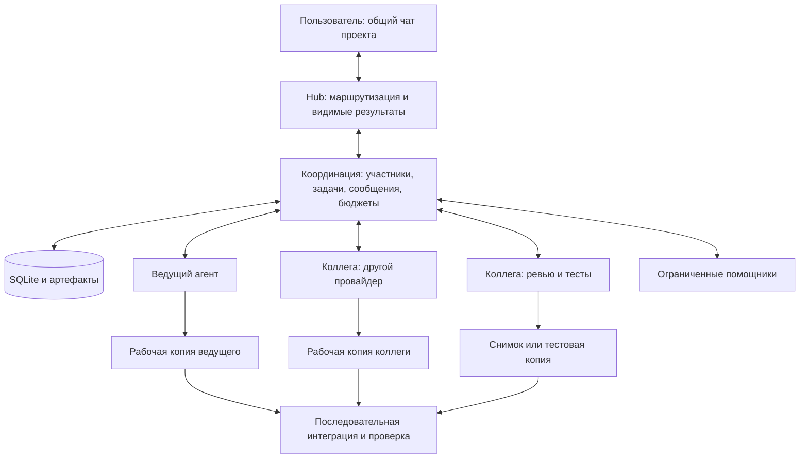

# Совместная работа агентов разных провайдеров в Hub

Дата исследования: 2026-09-27. Статус: исследование и предложение для обсуждения;
не принятый контракт, не план внедрения и не реализованная возможность.
Исходная ревизия Hub: `ea5af70b9332d8463b83d19f95ccda7c09e71faf`.
Изучены нормативные модули, связанные ADR, исходники и опубликованные первичные
источники. Эксперимент с несколькими продуктивными агентами и live E2E не проводился.

## Вывод

Описанная модель осуществима: один видимый чат проекта, ведущий агент, явно
подключаемые коллеги разных провайдеров и их ограниченные помощники. Ведущий может
писать код, распределять работу, обсуждать альтернативы и принимать результаты.
Для надёжной реализации нужны **общий реестр задач, адресные сообщения,
версионированные артефакты и отдельные рабочие копии одновременно пишущих агентов**.
Договорённости в чате полезны, но сами по себе не обеспечивают изоляцию и recovery.

Для Hub рекомендуется небольшой собственный слой координации над существующими
адаптерами и SQLite. MCP может дать моделям доступ к этому слою. A2A полезен как
будущий внешний интерфейс к самостоятельно работающим агентным сервисам; делать
его обязательным посредником между всеми локальными процессами сейчас оснований
нет. Ни MCP, ни A2A не решают за Hub конфликт Git-правок, полномочия, бюджет и
проверку результата.

Практическая стартовая конфигурация для проверки гипотезы — ведущий и один-два
коллеги; число одновременно пишущих участников ограничено независимо от числа
участников чата. Это предложение для эксперимента, а не найденный универсальный
оптимум. Безопасность можно обеспечить техническими ограничениями; превосходство
команды по качеству, времени и цене нужно измерить на задачах Hub.

## Что именно считать агентом и совместной работой

Модель, провайдер и агентный runtime — разные сущности. Модель генерирует ответы;
runtime ведёт сессию, вызывает инструменты и применяет sandbox; провайдер
обслуживает модель. Роль определяет задание и допустимые действия участника.
Следовательно, участник команды — отдельная сохраняемая идентичность с runtime,
provider/model/effort, ролью, сессией и выделенными ресурсами.

Переключение модели в одном runtime не создаёт независимого коллегу. Две модели
через один CLI также не доказывают независимость провайдеров. Запрошенный `high`
не универсальная мера качества: названия и наличие effort различаются.

| Вид участия | Можно одновременно? | Необходимое условие |
| --- | --- | --- |
| Числиться в команде и получать записи в inbox | Да, без вызова модели | Детерминированное сохранение событий |
| Анализировать, советовать, критиковать | Да, с расходом токенов | Явный вызов или ранее разрешённая подписка на конкретные события |
| Читать код для ревью | Да | Зафиксированная ревизия либо неизменяемый снимок |
| Запускать тесты | Да | Отдельные изменяемые файлы, процессы, порты и тестовые данные |
| Писать код и документы | Да | Одна рабочая копия и ветка на каждого одновременно пишущего исполнителя |
| Интегрировать результаты в целевую ветку | Последовательно | Один владелец интеграции и проверка итоговой ревизии |

«Наблюдает, но не вызывается» означает, что Hub копит разрешённые события.
Если модель сама решает, заслуживает ли очередная реплика возражения, она уже
вызвана и расходует токены. Бесплатного непрерывного размышления в фоне нет.

## Что в Hub уже есть и чего пока нет

| Основа | Подтверждённое состояние репозитория | Ограничение для новой модели |
| --- | --- | --- |
| Ведущий и спутники | Обычный ввод получает один активный агент; Reply/mention адресует коллегу | Вызов коллеги не меняет ведущего; полноценного team lifecycle нет |
| Видимый журнал | Сохраняется ограниченная история темы | Передача чужой истории выполняется явно через `/context`; автоматический handoff отключён |
| Очередь и recovery | Durable jobs, outbox, дедупликация и `indeterminate` | FIFO привязан к теме и включает границу финальной доставки |
| Изоляция записей | Один Hub-owned productive writer на canonical root | Один чат с несколькими одновременными исполнителями не получается простым увеличением лимита |
| Worktree lanes | Явная локальная привязка idle-темы к проверяемому Git worktree | Сейчас тема связана с одним execution scope; lane не создаётся из текста чата |
| Параллелизм | `max_parallel_roots`, fairness, отдельные provider workers | По одному слоту на локальный provider worker; общий лимит по умолчанию один |
| Полномочия | Sandbox, owner/root allowlists, отдельный канал approvals | Ведущий и коллеги не могут выдавать человеческое разрешение друг другу |

Источники текущего контракта:
[взаимодействие и контекст](../product/IDENTITY_AND_INTERACTION.md),
[очередь](../product/PERSISTENCE_AND_RECOVERY.md),
[владение и безопасность](../product/ACCOUNTS_CONTROL_AND_SECURITY.md),
[ADR 0009](../decisions/0009-explicit-context-no-automatic-handoff.md),
[ADR 0030](../decisions/0030-canonical-root-execution-exclusion.md),
[ADR 0031](../decisions/0031-bounded-root-concurrency.md).

Гарантия exclusion охватывает работу, координируемую одной SQLite Hub. Отдельные
legacy DM-базы, независимо запущенные CLI и внешний Hermes не становятся
участниками этой гарантии автоматически. Это существенное ограничение будущего
утверждения «все агенты знают о соседях».

Потребуется новый явно включаемый режим командной работы. Его нельзя незаметно
подменить обычным переключением провайдера: это изменит принятую политику затрат
и передачи контекста. Существующие ограничения — предмет осознанного пересмотра,
а не причина отказаться от исследования.

## Протоколы: что использовать для чего

| Механизм | Что предоставляет | Чего не предоставляет | Применение в Hub |
| --- | --- | --- | --- |
| MCP | Структурированные tools/resources/prompts; доступ runtime к внешним возможностям | Общую память моделей, распределение файлов, автоматическую приёмку и бюджет | Тонкий интерфейс к roster, задачам, inbox и артефактам |
| A2A | Agent Card, Message, Task, Artifact, получение статуса, streaming и запрос отмены | Git-изоляцию, единый sandbox, гарантию однократного внешнего эффекта | Адаптер к удалённому или самостоятельно управляемому агентному сервису |
| ACP, Agent Client Protocol | Связь клиентского интерфейса/IDE с coding agent | Организацию команды и общий scheduler | Возможная замена отдельных UI/runtime-адаптеров при достаточных capabilities |
| Native runtime API | Сессии, turns, события и специфические средства управления | Единую семантику всех провайдеров | Сохранить в provider adapters; проверять возможности по версиям |
| SQLite и локальное хранилище артефактов | Транзакции, состояния, причинность, устойчивые ссылки | Интеллектуальное распределение задач | Основа координации для текущей одномашинной архитектуры |
| Git worktree / отдельный clone | Раздельные рабочие деревья и изменения | Координацию API, процессов и внешних сервисов | Изоляция исполнения и проверяемая передача patches/commits |

Спецификация A2A прямо описывает MCP и A2A как дополняющие друг друга уровни
[S1]. На момент чтения опубликована A2A 1.0.0. В ней идемпотентность Send Message
разрешена, но не обязательна; `messageId` сам по себе не доказывает дедупликацию.
Отмена также не гарантирует остановку. Hub нужен собственный идентификатор
операции, receipts и консервативная обработка неопределённого результата.
Успешный A2A `completed` означает результат удалённого исполнителя, а не успешные
тесты Hub или принятие patch.

Актуальный индекс MCP включает редакцию 2026-07-28; Tasks описаны отдельным
расширением с durable handles и cooperative cancellation [S2, S3]. Это ещё один
довод не смешивать транспортный task с предметной задачей Hub. Поддержку Tasks
нужно проверять у конкретного клиента. Для первого интерфейса достаточно обычных
коротких tools, возвращающих идентификатор задания, и чтения его состояния.
Не следует требовать миграции всех runtime на новейшую редакцию протокола.

ACP относится к соединению клиента с агентом [S4]. Его наличие не означает,
что этот агент поддерживает peer messaging, бюджет подагентов или нужный режим
approval. Аналогично MCP sampling не стоит использовать как скрытый способ
разбудить другого провайдера: любой платный вызов должен проходить admission Hub.

## Что показывают существующие реализации

**Claude Code Agent Teams** — близкий пример пользовательской модели [S5]:
ведущий, отдельные контексты участников, task list, обнаружение коллег и адресные
сообщения. Документация также описывает конфликты при одновременной правке файла,
затраты, ограничения восстановления участников, вложенных teams и смены лидера.
Это полезный образец UX, но не готовая система межпровайдерной координации Hub.
Его defaults permissions нельзя автоматически переносить в Hub.

**Codex subagents** подтверждают возможность специализированных помощников с
отдельными model/effort и контекстами [S6]. Официальная документация рекомендует
осторожность для параллельных записей. App-server даёт threads, `turn/start`,
`turn/steer`, interrupt, события и адресованные approvals [S7]. Он не является
A2A endpoint. Наличие метода в документации ещё не подтверждает его поддержку
конкретной установленной версией; experimental dynamic tools не стоит делать
единственным каналом координации.

**OpenCode Server** публикует OpenAPI, sessions, events, async prompt и abort
[S8]. Это кандидат на более богатый adapter, если текущего CLI недостаточно.
Менять транспорт только ради похожести интерфейсов не нужно. Для Antigravity и
Hermes исследование опирается на уже принятые Hub adapters; эквивалентность
streaming, subagents, read-only и exact recovery здесь не доказана.

**Multi-agent Research Anthropic** показывает пользу независимых параллельных
ветвей исследования и передачи артефактов по ссылке [S9]. В опубликованных
измерениях команды расходовали около 15× токенов обычных чатов, а coding-задачи
отмечены как менее естественно параллелизуемые. Это результат конкретной системы,
не коэффициент цены Hub и не доказательство пользы смешения провайдеров.

Несколько сильных моделей могут находить разные ошибки, но независимость мнений
не гарантируется названием провайдера. Для существенного ревью полезно сначала
получить отдельные заключения по одному снимку, затем открыть взаимную критику.
Так уменьшается раннее подстраивание всех участников под первое уверенное мнение.

## Предлагаемая организация команды

Ведущий решает, что делать и чьё заключение принять. Детерминированный Hub
проверяет, разрешены ли вызов, контекст, инструменты, расход и запись. Для одного
хоста это может быть доменный модуль, а не новый обязательный сервис.

### Роли и полномочия

| Роль | Обычные действия | Полномочия на запись |
| --- | --- | --- |
| Ведущий | Декомпозиция, приглашения в разрешённом составе, решения, собственная реализация | Собственная lane; право запросить интеграцию в пределах задачи |
| Архитектор / советник | Анализ ограничений и альтернатив | По умолчанию только отчёт |
| Критик / reviewer | Поиск опровержений, дефектов, рисков | По умолчанию только review findings |
| Исполнитель | Код, документация, локальная проверка | Только назначенная lane и согласованный scope |
| Тестировщик | Воспроизведение, тесты, доказательства | Изолированная тестовая среда; запись тестов по отдельному scope |
| Помощник | Узкое поручение родителя | Минимально необходимые права; по умолчанию чтение |

Роль — preset инструкций и прав, не только текст «ты критик». Техническая
возможность изменить чужую копию не должна зависеть от послушания модели.
Права ребёнка не шире прав родителя и ограничиваются выданной задачей.

Решение ведущего «принимаю реализацию» относится к содержанию работы.
Оно не является разрешением на network escalation, deployment, доступ к secrets
или другое действие, требующее owner approval. Смена роли также не расширяет
права автоматически. Пользователь может адресоваться любому участнику напрямую;
Reply сохраняет адресата, а назначение нового ведущего является отдельной операцией.

### Присутствие, пробуждение и завершение

Полезны раздельные состояния: доступен для приглашения, приглашён, выполняет
задание, ожидает, завершил участие, отменяется, остановлен, исход неизвестен.
Наличие provider session не означает, что агент сейчас работает.

По умолчанию коллега отсутствует в активном workflow. Его вызывает пользователь
либо ведущий в пределах заранее разрешённого team policy: список runtime/model,
допустимые роли, контекст, бюджет, число исполнителей и глубина делегации.
Разовый запрос «проверь patch» не превращается в бессрочную подписку.

Подписка может разрешать платный вызов на конкретное событие, например
`artifact_submitted`, один review на одну ревизию. Чат целиком не транслируется
всем моделям. События можно копить без inference и доставлять в следующем
разрешённом ходе. Публикация реплики или mention внутри вывода агента сама по себе
не считается вызовом коллеги: вызов идёт через типизированную операцию Hub.

В первом варианте сообщения работающему агенту доступны через inbox tool и на
границе следующего хода. Прерывание/steering допускается только после проверки
adapter capability и происхождения сообщения. Нельзя превратить замечание
коллеги в якобы новое распоряжение человека посредством `turn/steer`.

При смене ведущего Hub увеличивает поколение полномочий; старое поколение больше
не может выдавать задания и принимать результаты. Если прежний процесс ещё
жив, его незавершённая lane остаётся занятой или карантинной. Само истечение
lease не доказывает физическую остановку записи.

## Обмен данными: что хранить кроме чата

Рекомендуются четыре логически отдельные сущности в одном локальном хранилище.

1. **Состав команды.** Кто приглашён, роль, родитель, runtime/model/effort,
   текущая задача, lane, состояние и поколение полномочий. Это позволяет узнать
   о соседях без запроса ко всем моделям.
2. **Задачи и зависимости.** Цель, входная ревизия, ответственный, ожидаемый
   результат, разрешённый scope, зависимости, бюджет, критерии приёмки.
   Назначение и claim атомарны. Один task имеет одного ответственного;
   review и тестирование оформляются связанными tasks.
3. **Адресные сообщения и события.** Вопрос, ответ, finding, предложение,
   решение, blocker, результат. Hub записывает отправителя из аутентифицированной
   сессии, а не из поля, придуманного моделью. У сообщения есть адресат,
   task/correlation ID, порядковый номер, дедупликация и подтверждение доставки.
4. **Артефакты и решения.** Commit/patch, документ, проверенный отчёт о тестах,
   выбранный вариант с основаниями и неснятыми возражениями. Они адресуются
   устойчивыми ID и digest, а не изменяемым названием ветки или произвольным URL.

Chat — видимая проекция этой работы. Он удобен для человека, но не должен быть
единственным источником task status. Telegram не доставляет сообщения ботов
другим ботам; Hub должен маршрутизировать сообщения локально [S10].

Минимальный пакет задания содержит цель и критерий завершения, базовый Git SHA,
версию интерфейсного соглашения, релевантные решения, ссылки на входные артефакты,
границы записи и бюджета. Участник может запросить дополнительный контекст.
Передача всей истории всем участникам обычно увеличивает цену и размывает задачу.

Ответ исполнителя связывает summary, результат, base SHA, candidate SHA/digest,
изменённые файлы, проверочные команды и исходы, ограничения, риски и зависимости.
Hub/runner подтверждает наблюдаемые факты отдельно от утверждений модели.
«Тесты прошли» без ревизии и результата runner остаётся заявлением участника.

Для awareness каждому вызову достаточно ограниченного снимка состава и активных
задач плюс относящихся к заданию новых событий. Cursor доставки и acknowledgement
хранятся отдельно от статуса задачи. Порядок гарантируется в рамках task/mailbox;
для зависимостей используются явные связи и ревизии, а не время прихода текста.
При compaction сохраняется снимок с provenance и ссылками; противоречия нельзя
терять при пересказе. Raw tool output и hidden reasoning не становятся общим
контекстом; проверенные агрегаты тестов и разрешённые project artifacts имеют
отдельную схему и правила доступа.

Возможная поверхность MCP ниже — эскиз, этих tools в Hub сейчас нет:

| Операция | Результат и ограничение |
| --- | --- |
| `team.list` | Разрешённые участники и активные назначения текущей команды |
| `task.create`, `task.claim`, `task.get` | Durable ID, проверка полномочий, зависимостей и версии записи |
| `message.send`, `inbox.read` | Адресный обмен; отправка не равна платному пробуждению |
| `artifact.submit`, `artifact.read` | Проверенный immutable объект и разрешённая выборка |
| `task.submit`, `review.record` | Результат для проверки и review, а не самостоятельное принятие |
| `task.accept`, `task.cancel` | Только уполномоченный actor; отмена сначала является запросом |

На MVP часть операций можно объединить. Модель не получает произвольный путь,
shell command, SQL или право выбирать caller identity. Team/task/lane IDs
разрешаются локально. Scoped credential относится к конкретной сессии и
поколению; весь provider token и Telegram credentials в MCP не передаются.

## Как не ломать код и окружение друг друга

Основной вариант: **одновременно пишущие агенты работают в разных worktrees
и ветках, а интеграция сериализована**. Ведущий тоже соблюдает это правило.
Для каждого задания фиксируется базовая ревизия, а интерфейсы и зависимости
договариваются до параллельной реализации.

Git worktree имеет отдельные HEAD/index, но разделяет часть Git metadata и refs
[S11]. Поэтому worktree — защита от обычных пересечений рабочих файлов, не
полная security boundary. Команда Git из одной копии при достаточных правах
способна затронуть другие refs. `git worktree lock` защищает от pruning, а не
от записи другого агента.

Нужны ограничения runtime/OS на чужие рабочие деревья и общую Git-администрацию.
Создание/удаление lanes, опасные Git-операции, hooks/config и интеграцию лучше
проводить через ограниченный broker. Если конкретный runtime не позволяет
доказать такую границу, для writable-роли нужен отдельный clone с подходящей
изоляцией процесса/контейнера либо роль ограничивается артефактами. Сам clone
без файловых ограничений тоже не является sandbox.

Разделение файлов полезно как планировочное обещание, но не как единственная
защита. Rename, formatter, lockfile и generated files пересекаются вне заранее
названного файла. Центральные схемы, миграции, dependency manifests и публичные
интерфейсы лучше назначать одному владельцу; согласованные изменения поступают
другим участникам как новая версия контракта.

Для тестирования нужны отдельные temp/build directories, порты, PID/process
ownership, тестовые базы и данные. Общие изменяемые `.venv`, dependency cache,
Docker service names и dev server тоже могут конфликтовать. Read-only reviewer
читает immutable snapshot; выполнение тестов, которое пишет кэши или fixtures,
требует тестовой lane. Общий production database не является тестовой средой.

### Передача и приёмка изменения

1. Исполнитель публикует зафиксированный candidate и сведения о проверке.
   После submit изменение candidate создаёт новую версию и отменяет актуальность
   старого review.
2. Reviewer рассматривает точный candidate. Другой участник может проверить
   тесты либо оспорить конкретное утверждение с воспроизведением.
3. Ведущий принимает, возвращает на доработку или отклоняет результат с причиной.
   Участник не принимает собственную работу от имени ведущего.
4. Единственный integrator переносит принятый candidate в integration lane.
   Проверяется ожидаемый target HEAD; при его изменении расчёт интеграции и
   проверки обновляются. Apply и запись receipt должны восстанавливаться после
   падения, не создавая повторную интеграцию.
5. Проверки выполняются на итоговой объединённой ревизии. Даже чистый Git merge
   не исключает несовместимость поведения двух изменений.
6. Cleanup выполняется отдельно: проверяются tracked/staged/untracked файлы,
   удерживаются результаты, unresolved work и необходимые recovery-ссылки.

Состояния «исполнитель закончил», «ведущий принял», «интегрировано», «проверено»
и «развёрнуто» различны. Ведущий может принимать результат без отдельного
человеческого подтверждения там, где пользователь уже разрешил обычную работу.
Deployment и security approvals сохраняют существующую границу.

## Сбои, гонки и ограничения параллелизма

Предметная задача живёт дольше одного model turn. Нужно отдельно хранить
назначение, попытки исполнения, сообщения, candidate и приёмку. Таймаут tool
в MCP/A2A не превращает потенциально исполненное задание в новое.

| Ситуация | Требуемое поведение предлагаемой системы |
| --- | --- |
| Повтор сообщения или tool call | Один admission receipt; существующий task возвращается повторно |
| Потеря связи после начала provider turn | `indeterminate`; read-only reconciliation при наличии capability, без слепого replay |
| Истёк lease, старый worker ожил | Старое поколение отклоняется; потенциальная запись в его lane остаётся изолированной |
| Stop во время активной работы | Запрос native cancel, учёт потомков, подтверждение терминальности; неизвестный исход виден |
| Сбой отправки в Telegram | Повторяется доставка, не model turn |
| Поздний ответ на отменённую задачу | Сохраняется для аудита, не принимается автоматически |
| Изменился target HEAD | Review/тесты помечаются устаревшими по зависимостям; требуется новая интеграционная проверка |
| Перезапуск или смена ведущего | Новый authority epoch; состояние задач сохраняется, неизвестная работа не повторяется |
| Циклическое ожидание коллег | Проверка task dependencies и deadline; blocker возвращается ведущему |
| Исчерпан бюджет | Новые productive calls отклоняются; уже запущенное учитывается и завершается/останавливается по policy |

Особенно опасен deadlock «родитель занял единственный слот провайдера и ждёт
помощника того же провайдера». Синхронный MCP вызов `spawn-and-wait` не исправляет
это. Нужен асинхронный submit, возможность закончить текущий turn и сохранить
continuation либо отдельный разрешённый worker slot. Освобождать writer lease
при ещё работающем процессе нельзя. То же относится к глобальному лимиту один.
Перед передачей слота нужна доказанная терминальность родительского turn и его
пишущих инструментов; помощник получает собственную lane. «Ожидает» не равно
«остановлен». Непрозрачные native subagents не допускаются к записи в общую копию.
Подробнее — [границы прототипа](MULTI_AGENT_EVALUATION.ru.md#критические-границы-прототипа).

Нельзя обойти нынешний FIFO темы простым прямым вызовом adapter из MCP: пропадут
admission, stop и recovery. В командном режиме предлагается разделить
**conversation** и **execution lane/task**. Один видимый topic содержит несколько
явно связанных task streams; порядок исполнения сохраняется внутри lane, а
зависимости между lanes задаются задачами. Это новая граница контракта, требующая
ADR, миграции и fault tests. Создание фиктивных Telegram-тем для каждого помощника
не является хорошей заменой такой модели.

Детерминированные workers могут обслуживать уже разрешённый workflow, но
healthchecks, telemetry timers и recovery probes по-прежнему не запускают модели.
Event-driven продолжение оплачиваемой задачи должно ссылаться на исходное
разрешение и бюджет; «агент давно молчит» не является основанием для inference.

## Сильные коллеги и дешёвые помощники

Разумная иерархия — ведущий, специалисты и один ограниченный уровень помощников.
Каждый специалист может запросить помощника через Hub в пределах своей квоты;
это не бесконтрольное создание новых команд. Конкретные лимиты выбираются после
измерения, а не закладываются как свойство провайдера.

Помощнику подходят поиск по коду, выделение релевантных файлов, узкая проверка,
классификация тестовых ошибок и ограниченный первый проход review. Сильной
модели остаются неоднозначность, архитектурные границы, трудные гипотезы,
разногласия и итоговая интеграция. Детерминированную операцию иногда дешевле
выполнить инструментом без отдельной модели.

Стоимость делегации включает работу помощника, чтение и проверку его ответа
старшей моделью, повторные попытки, потерю контекста и интеграцию. Снижение
токенов ведущего ещё не доказывает снижение полной стоимости. Малый scope,
компактный структурированный ответ и ссылки на артефакты важнее лозунга
«всё отдавать дешёвой модели».

Общий бюджет резервируется транзакционно по дереву задач до запуска; потомки
списываются из общего лимита и локальной доли. Нужны ограничения на одновременные
turns, число потомков, глубину, объём контекста, время и раунды обсуждения.
При отсутствии точной provider usage используются консервативные резервы и
лимиты вызовов/времени, а не фиктивный точный денежный остаток. Для уже активного
turn стоимость может превысить оценку; строгий денежный cap нельзя обещать без
поддержки провайдера.

Native subagents runtime допустимы только если понятны их права, изоляция,
родительство, stop и учёт расхода. Иначе Hub либо запускает помощников сам,
либо прямо показывает неполную наблюдаемость. Нельзя считать командный бюджет
строгим, если один участник может незаметно создавать неучтённых потомков.

Для спора полезен ограниченный процесс: независимое предложение → конкретное
возражение → проверка или воспроизведение → решение с оставшейся неопределённостью.
Например, два раунда могут быть начальной настройкой эксперимента. Голосование
моделей не заменяет тест и не доказывает истину. Вопрос владельцу нужен при выборе
продуктового результата или новых полномочий, а не при каждом расхождении мнений.

## Безопасность общего контекста

Сообщения коллег, тексты документов и результаты tools являются данными с
происхождением. Они не могут менять root, роль, policy или выдавать человеческое
согласие. Особенно важен запрет relay-обхода: если один агент получил отказ,
поручение тому же действию соседу не создаёт новое разрешение.

Allowlist провайдера недостаточен для передачи любых данных проекта. Team policy
задаёт разрешённых получателей и типы контекста; новый провайдер не получает
секреты и всю историю автоматически. Авторство, scope и ACL проверяются Hub,
артефакты читаются через opaque ID с ограничениями размера и digest. Удалённый
artifact URL нельзя автоматически скачивать с произвольного адреса: это отдельная
граница сетевого доступа. Hidden reasoning между моделями не передаётся.

Человеческий approval связан с точными runtime/session/turn/action, а не со
словом «да» в общем чате. Коллега может согласиться с планом или результатом,
но не подтвердить sandbox escalation. Существующее владение Codex/tlive
сохраняется; канал согласования результата не становится каналом approvals.

## Варианты развития и проверка гипотезы

[Приложение с этапами и критериями проверки](MULTI_AGENT_EVALUATION.ru.md)
сравнивает варианты реализации и описывает путь от вызванного reviewer к двум
пишущим исполнителям, помощникам и внешнему A2A adapter. Там же перечислены
изменяемые контракты Hub, сценарии отказов и метрики сравнения с одним агентом.
Это предложение для следующего решения, а не утверждённый roadmap.

## Первичные источники

Страницы прочитаны при подготовке исследования 2026-09-27 по московскому времени.
Web-документация изменяется; версии реальных runtime и доступность возможностей
нужно зафиксировать отдельно перед реализацией. Ссылки подтверждают описанные
механизмы; выбор архитектуры Hub и этапов выше — вывод исследования.

- **[S1]** [A2A specification](https://a2a-protocol.org/latest/specification/):
  версия 1.0.0, Task/Message/Artifact/Agent Card, §3.1.5 cancellation,
  §3.3.1 idempotency, Appendix B о связи с MCP.
- **[S2]** [MCP architecture, 2026-07-28](https://modelcontextprotocol.io/specification/2026-07-28/architecture/index):
  host/client/server, инструменты и ресурсы, границы контекста и capabilities.
- **[S3]** [MCP Tasks extension](https://modelcontextprotocol.io/extensions/tasks/overview):
  durable task handles, polling, lifecycle и cooperative cancellation.
- **[S4]** [Agent Client Protocol introduction](https://agentclientprotocol.com/overview/introduction):
  назначение ACP и связь editor/client с coding agent.
- **[S5]** [Claude Code Agent Teams](https://code.claude.com/docs/en/agent-teams):
  задачи, сообщения, раздельные контексты, permissions и limitations.
- **[S6]** [Official OpenAI documentation: Codex subagents](https://developers.openai.com/codex/multi-agent):
  делегация, модели/effort, контекст, затраты и осторожность при параллельной записи.
- **[S7]** [Official OpenAI documentation: Codex app-server](https://developers.openai.com/codex/app-server/):
  threads/turns, steering, interrupt, approvals и experimental dynamic tools.
- **[S8]** [OpenCode Server](https://opencode.ai/docs/server/):
  OpenAPI, sessions, async prompts, abort и события.
- **[S9]** [Anthropic: How we built our multi-agent research system](https://www.anthropic.com/engineering/multi-agent-research-system):
  orchestration, независимые задания, token costs, ограничения и артефакты.
- **[S10]** [Telegram Bot FAQ: What messages will my bot get?](https://core.telegram.org/bots/faq#what-messages-will-my-bot-get):
  ограничение доставки сообщений от других ботов.
- **[S11]** [Git worktree](https://git-scm.com/docs/git-worktree):
  раздельные рабочие деревья, общие refs/config и назначение worktree lock.
